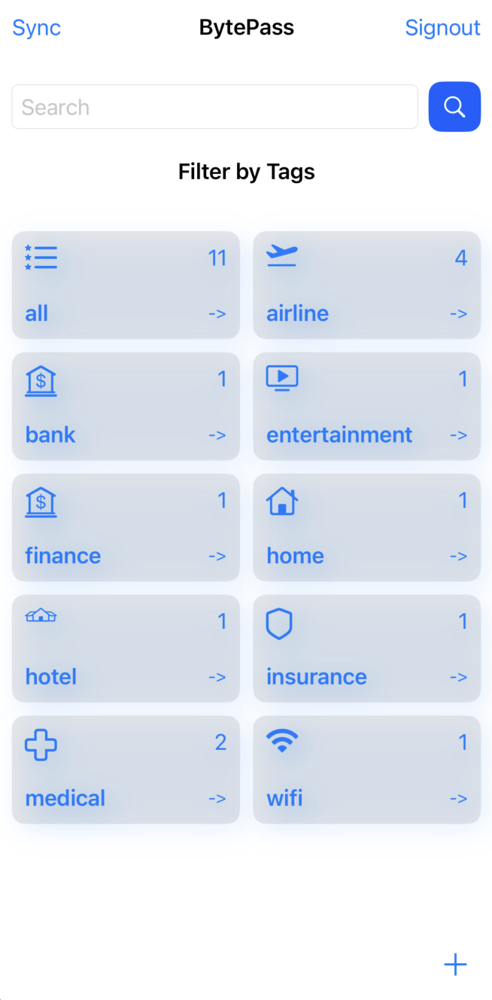
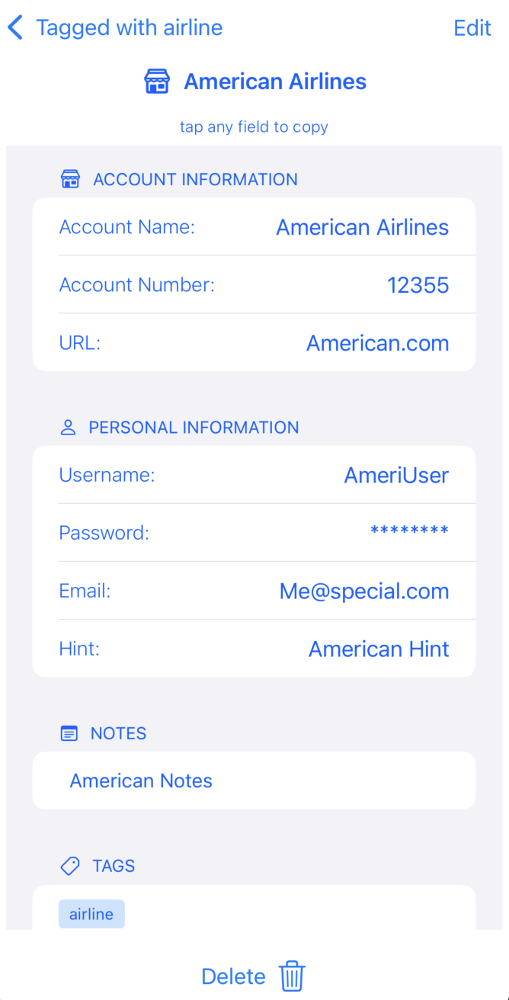
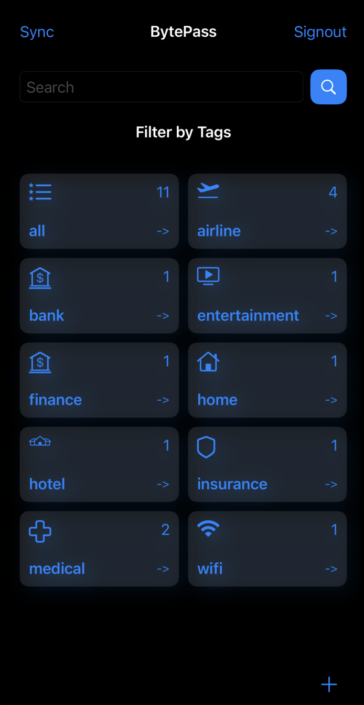
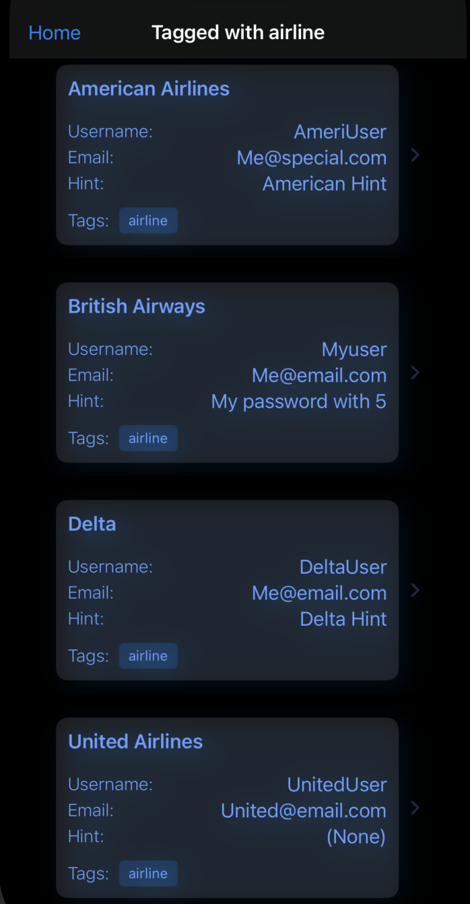
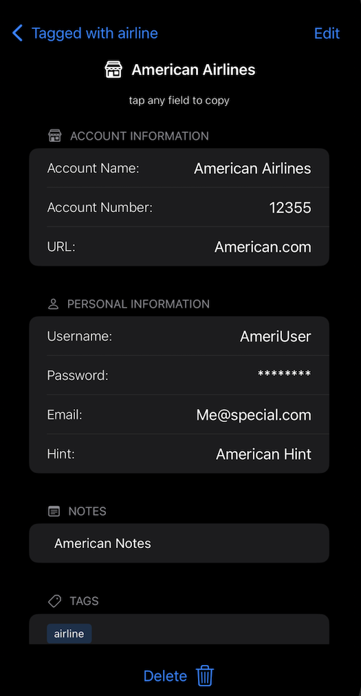
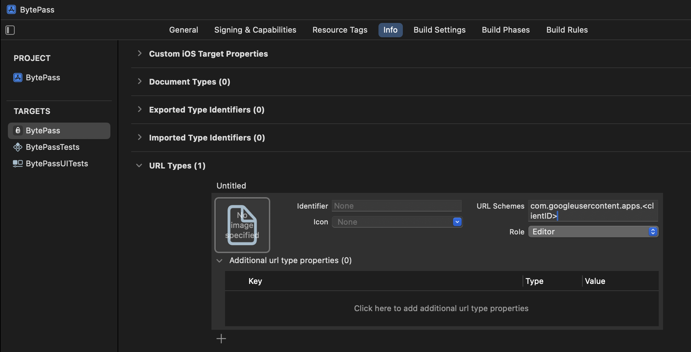

# BytePass

## Password Management IOS App

Basic account management with online accounts and keeping track of login information
like user/passwords. Provides a syncing capability so that you can share this account
information with multiple devices leveraging your personal Google Drive account. This
data is only stored locally on the device and in app data folders on Google Drive,
nowhere else.

Current state needs UI/UX work, but completely functional.

Light Mode

 ->  ->   

Dark Mode

 ->  ->   


## Getting Started with Development

After cloning this repo, you'll want to set up integration with Google Drive
so that the 'sync' button works.

Currently using swift-google-drive-client to integrate with GoogleDrive, 
but working on alternative approaches as well. For existing
approach, you need to configure the OAuth 2.0 Client ID (selecting  `iOS` application type) 
using [Google Cloud Console](https://console.cloud.google.com/).

After cloning this repo, you need to add the following code somewhere with client ID provided in setup. For example, you can create a file named GoogleClientConfig.swift and paste there

```
import GoogleDriveClient

func getConfig() -> Config {
    Config(
        clientID:
            <client id>.apps.googleusercontent.com",
        authScope: "https://www.googleapis.com/auth/drive.appdata",
        redirectURI:
            "com.googleusercontent.apps.<client id>q://"
    )
}

```

Finally, you need to handle the redirect once the user is logged into Google. 
Adding a URL type allows this app to handle that request. Set value as shown below,
keeping in mind that you only fill out 'URL Schemes' (nothing else) with value from 
the 'redirect URI'provided by Google.




